# 📐 Software Model — Student Performance & Study Factors Dashboard

> **Project:** Student Performance & Study Factors Dashboard
> **Subject:** Database Management Systems (DBMS)
> **Date:** November 2026

---

## Table of Contents

1. [Use Case Diagram](#1-use-case-diagram)
2. [Class Diagram](#2-class-diagram)
3. [Sequence Diagrams](#3-sequence-diagrams)
4. [Activity Diagrams](#4-activity-diagrams)
5. [State Diagram](#5-state-diagram)
6. [Data Flow Diagrams (DFD)](#6-data-flow-diagrams)
7. [ER Diagram](#7-er-diagram)
8. [Component Diagram](#8-component-diagram)
9. [Deployment Diagram](#9-deployment-diagram)

---

## 1. Use Case Diagram

> Shows **who** uses the system and **what** they can do.

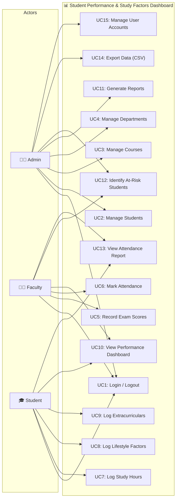
```mermaid
flowchart LR
    subgraph Actors
        A["🧑‍💼 Admin"]
        F["👩‍🏫 Faculty"]
        S["🎓 Student"]
    end

    subgraph System["📊 Student Performance & Study Factors Dashboard"]
        UC1["UC1: Login / Logout"]
        UC2["UC2: Manage Students"]
        UC3["UC3: Manage Courses"]
        UC4["UC4: Manage Departments"]
        UC5["UC5: Record Exam Scores"]
        UC6["UC6: Mark Attendance"]
        UC7["UC7: Log Study Hours"]
        UC8["UC8: Log Lifestyle Factors"]
        UC9["UC9: Log Extracurriculars"]
        UC10["UC10: View Performance Dashboard"]
        UC11["UC11: Generate Reports"]
        UC12["UC12: Identify At-Risk Students"]
        UC13["UC13: View Attendance Report"]
        UC14["UC14: Export Data (CSV)"]
        UC15["UC15: Manage User Accounts"]
    end

    A --> UC1
    A --> UC2
    A --> UC3
    A --> UC4
    A --> UC11
    A --> UC12
    A --> UC14
    A --> UC15

    F --> UC1
    F --> UC5
    F --> UC6
    F --> UC10
    F --> UC12
    F --> UC13

    S --> UC1
    S --> UC7
    S --> UC8
    S --> UC9
    S --> UC10
    S --> UC13
```

### Use Case Descriptions

| Use Case ID | Name | Actor(s) | Description |
|-------------|------|----------|-------------|
| UC1 | Login / Logout | Admin, Faculty, Student | User authenticates with username & password, system validates and grants role-based access |
| UC2 | Manage Students | Admin | Add, update, delete, and search student records |
| UC3 | Manage Courses | Admin | Create/modify courses, assign faculty, set credits |
| UC4 | Manage Departments | Admin | Add or update department information |
| UC5 | Record Exam Scores | Faculty | Enter marks for students per course per exam; grade auto-calculated |
| UC6 | Mark Attendance | Faculty | Mark present/absent/late for each session |
| UC7 | Log Study Hours | Student | Record daily study hours per subject with study method |
| UC8 | Log Lifestyle Factors | Student | Record sleep, internet usage, stress, physical activity, job status |
| UC9 | Log Extracurriculars | Student | Add clubs, sports, volunteering activities with weekly hours |
| UC10 | View Performance Dashboard | Faculty, Student | View charts: score trends, study-vs-marks, sleep impact, attendance |
| UC11 | Generate Reports | Admin | Generate and download PDF/CSV reports per student or department |
| UC12 | Identify At-Risk Students | Admin, Faculty | View students with attendance < 75% or avg marks < 40% |
| UC13 | View Attendance Report | Faculty, Student | View attendance percentage per course |
| UC14 | Export Data (CSV) | Admin | Export filtered data tables to CSV files |
| UC15 | Manage User Accounts | Admin | Create/deactivate user accounts, assign roles |

---

## 2. Class Diagram

> Shows the **structure** of the system — classes, attributes, methods, and relationships.

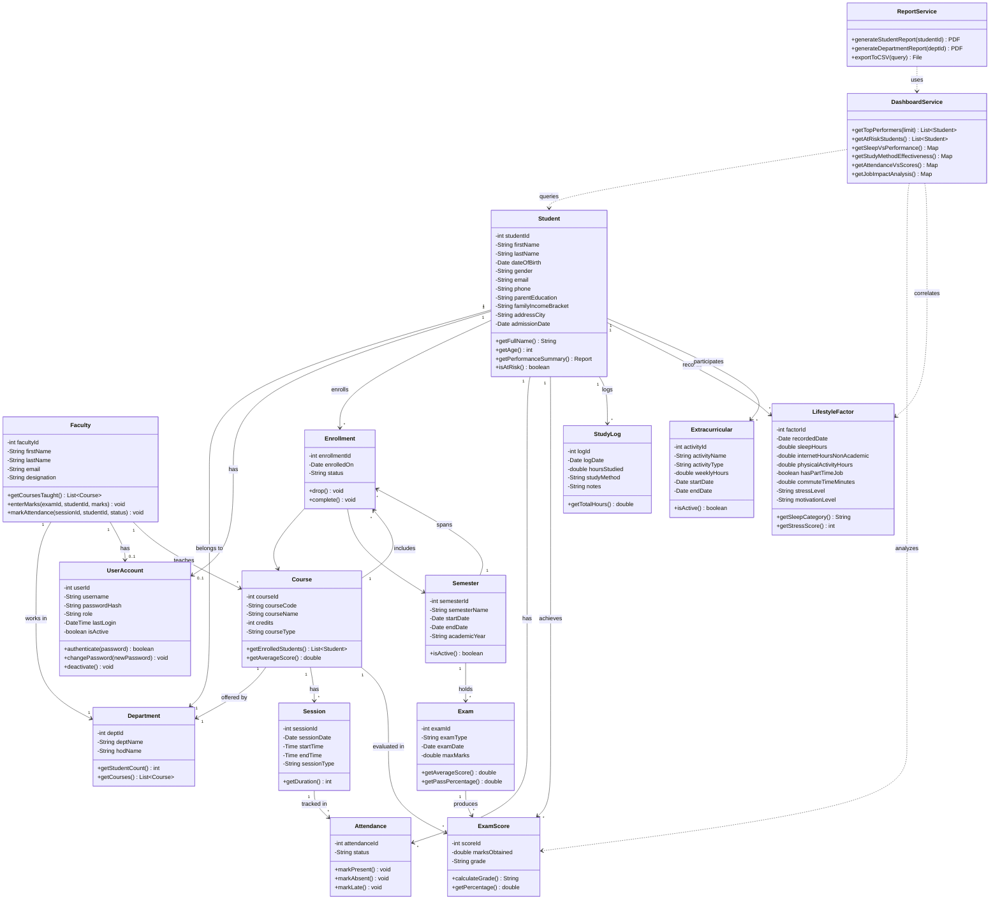
```mermaid
classDiagram
    class Student {
        -int studentId
        -String firstName
        -String lastName
        -Date dateOfBirth
        -String gender
        -String email
        -String phone
        -String parentEducation
        -String familyIncomeBracket
        -String addressCity
        -Date admissionDate
        +getFullName() String
        +getAge() int
        +getPerformanceSummary() Report
        +isAtRisk() boolean
    }

    class Department {
        -int deptId
        -String deptName
        -String hodName
        +getStudentCount() int
        +getCourses() List~Course~
    }

    class Faculty {
        -int facultyId
        -String firstName
        -String lastName
        -String email
        -String designation
        +getCoursesTaught() List~Course~
        +enterMarks(examId, studentId, marks) void
        +markAttendance(sessionId, studentId, status) void
    }

    class Course {
        -int courseId
        -String courseCode
        -String courseName
        -int credits
        -String courseType
        +getEnrolledStudents() List~Student~
        +getAverageScore() double
    }

    class Semester {
        -int semesterId
        -String semesterName
        -Date startDate
        -Date endDate
        -String academicYear
        +isActive() boolean
    }

    class Enrollment {
        -int enrollmentId
        -Date enrolledOn
        -String status
        +drop() void
        +complete() void
    }

    class Session {
        -int sessionId
        -Date sessionDate
        -Time startTime
        -Time endTime
        -String sessionType
        +getDuration() int
    }

    class Attendance {
        -int attendanceId
        -String status
        +markPresent() void
        +markAbsent() void
        +markLate() void
    }

    class Exam {
        -int examId
        -String examType
        -Date examDate
        -double maxMarks
        +getAverageScore() double
        +getPassPercentage() double
    }

    class ExamScore {
        -int scoreId
        -double marksObtained
        -String grade
        +calculateGrade() String
        +getPercentage() double
    }

    class StudyLog {
        -int logId
        -Date logDate
        -double hoursStudied
        -String studyMethod
        -String notes
        +getTotalHours() double
    }

    class LifestyleFactor {
        -int factorId
        -Date recordedDate
        -double sleepHours
        -double internetHoursNonAcademic
        -double physicalActivityHours
        -boolean hasPartTimeJob
        -double commuteTimeMinutes
        -String stressLevel
        -String motivationLevel
        +getSleepCategory() String
        +getStressScore() int
    }

    class Extracurricular {
        -int activityId
        -String activityName
        -String activityType
        -double weeklyHours
        -Date startDate
        -Date endDate
        +isActive() boolean
    }

    class UserAccount {
        -int userId
        -String username
        -String passwordHash
        -String role
        -DateTime lastLogin
        -boolean isActive
        +authenticate(password) boolean
        +changePassword(newPassword) void
        +deactivate() void
    }

    class DashboardService {
        +getTopPerformers(limit) List~Student~
        +getAtRiskStudents() List~Student~
        +getSleepVsPerformance() Map
        +getStudyMethodEffectiveness() Map
        +getAttendanceVsScores() Map
        +getJobImpactAnalysis() Map
    }

    class ReportService {
        +generateStudentReport(studentId) PDF
        +generateDepartmentReport(deptId) PDF
        +exportToCSV(query) File
    }

    Student "1" --> "1" Department : belongs to
    Student "1" --> "0..1" UserAccount : has
    Student "1" --> "*" Enrollment : enrolls
    Student "1" --> "*" Attendance : has
    Student "1" --> "*" ExamScore : achieves
    Student "1" --> "*" StudyLog : logs
    Student "1" --> "*" LifestyleFactor : records
    Student "1" --> "*" Extracurricular : participates

    Faculty "1" --> "1" Department : works in
    Faculty "1" --> "0..1" UserAccount : has
    Faculty "1" --> "*" Course : teaches

    Course "1" --> "1" Department : offered by
    Course "1" --> "*" Enrollment : includes
    Course "1" --> "*" Session : has
    Course "1" --> "*" ExamScore : evaluated in

    Semester "1" --> "*" Enrollment : spans
    Semester "1" --> "*" Exam : holds

    Session "1" --> "*" Attendance : tracked in

    Exam "1" --> "*" ExamScore : produces

    Enrollment --> Course
    Enrollment --> Semester

    DashboardService ..> Student : queries
    DashboardService ..> ExamScore : analyzes
    DashboardService ..> LifestyleFactor : correlates
    ReportService ..> DashboardService : uses
```

---

## 3. Sequence Diagrams

> Shows the **order of interactions** between objects over time.

### 3.1 Login Sequence

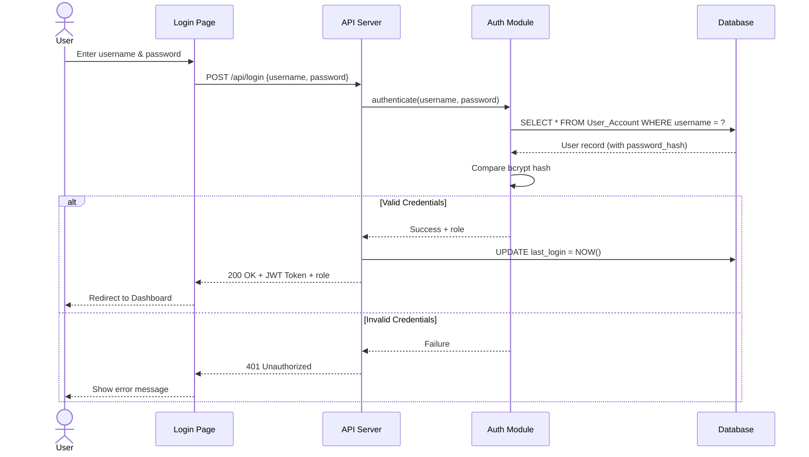
```mermaid
sequenceDiagram
    actor U as User
    participant UI as Login Page
    participant API as API Server
    participant Auth as Auth Module
    participant DB as Database

    U->>UI: Enter username & password
    UI->>API: POST /api/login {username, password}
    API->>Auth: authenticate(username, password)
    Auth->>DB: SELECT * FROM User_Account WHERE username = ?
    DB-->>Auth: User record (with password_hash)
    Auth->>Auth: Compare bcrypt hash
    alt Valid Credentials
        Auth-->>API: Success + role
        API->>DB: UPDATE last_login = NOW()
        API-->>UI: 200 OK + JWT Token + role
        UI-->>U: Redirect to Dashboard
    else Invalid Credentials
        Auth-->>API: Failure
        API-->>UI: 401 Unauthorized
        UI-->>U: Show error message
    end
```

### 3.2 Record Exam Score Sequence

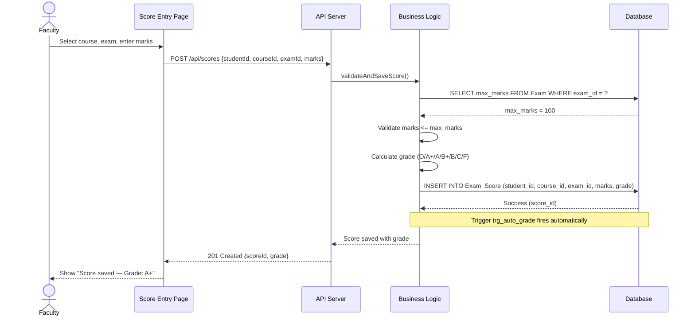
```mermaid
sequenceDiagram
    actor F as Faculty
    participant UI as Score Entry Page
    participant API as API Server
    participant Logic as Business Logic
    participant DB as Database

    F->>UI: Select course, exam, enter marks
    UI->>API: POST /api/scores {studentId, courseId, examId, marks}
    API->>Logic: validateAndSaveScore()
    Logic->>DB: SELECT max_marks FROM Exam WHERE exam_id = ?
    DB-->>Logic: max_marks = 100
    Logic->>Logic: Validate marks <= max_marks
    Logic->>Logic: Calculate grade (O/A+/A/B+/B/C/F)
    Logic->>DB: INSERT INTO Exam_Score (student_id, course_id, exam_id, marks, grade)
    DB-->>Logic: Success (score_id)

    Note over Logic,DB: Trigger trg_auto_grade fires automatically

    Logic-->>API: Score saved with grade
    API-->>UI: 201 Created {scoreId, grade}
    UI-->>F: Show "Score saved — Grade: A+"
```

### 3.3 View Dashboard Sequence

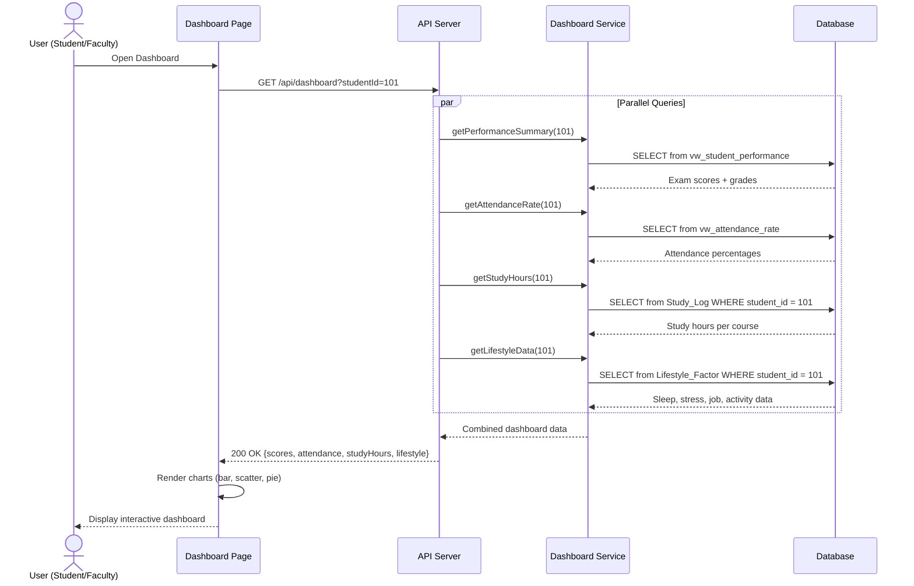
```mermaid
sequenceDiagram
    actor U as User (Student/Faculty)
    participant UI as Dashboard Page
    participant API as API Server
    participant DS as Dashboard Service
    participant DB as Database

    U->>UI: Open Dashboard
    UI->>API: GET /api/dashboard?studentId=101

    par Parallel Queries
        API->>DS: getPerformanceSummary(101)
        DS->>DB: SELECT from vw_student_performance
        DB-->>DS: Exam scores + grades

        API->>DS: getAttendanceRate(101)
        DS->>DB: SELECT from vw_attendance_rate
        DB-->>DS: Attendance percentages

        API->>DS: getStudyHours(101)
        DS->>DB: SELECT from Study_Log WHERE student_id = 101
        DB-->>DS: Study hours per course

        API->>DS: getLifestyleData(101)
        DS->>DB: SELECT from Lifestyle_Factor WHERE student_id = 101
        DB-->>DS: Sleep, stress, job, activity data
    end

    DS-->>API: Combined dashboard data
    API-->>UI: 200 OK {scores, attendance, studyHours, lifestyle}
    UI->>UI: Render charts (bar, scatter, pie)
    UI-->>U: Display interactive dashboard
```

### 3.4 Log Study Hours Sequence

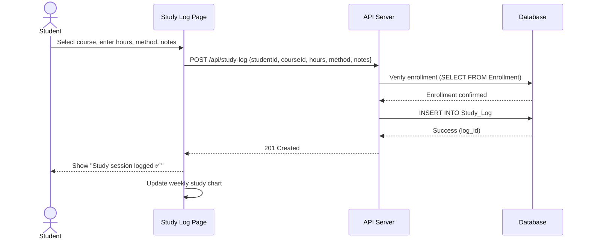
```mermaid
sequenceDiagram
    actor S as Student
    participant UI as Study Log Page
    participant API as API Server
    participant DB as Database

    S->>UI: Select course, enter hours, method, notes
    UI->>API: POST /api/study-log {studentId, courseId, hours, method, notes}
    API->>DB: Verify enrollment (SELECT FROM Enrollment)
    DB-->>API: Enrollment confirmed
    API->>DB: INSERT INTO Study_Log
    DB-->>API: Success (log_id)
    API-->>UI: 201 Created
    UI-->>S: Show "Study session logged ✅"
    UI->>UI: Update weekly study chart
```

### 3.5 Identify At-Risk Students Sequence

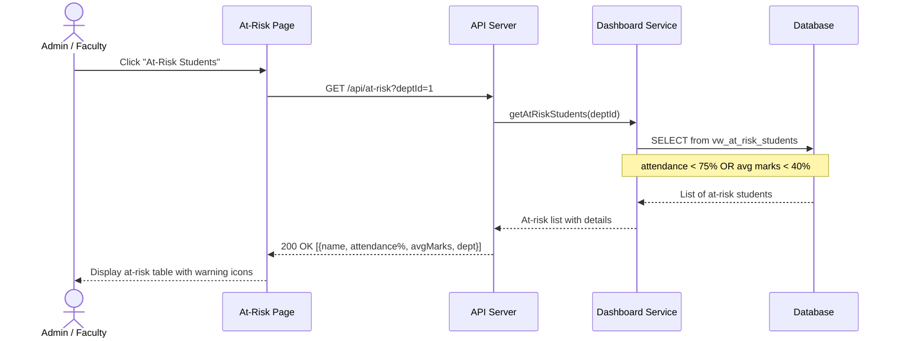
```mermaid
sequenceDiagram
    actor A as Admin / Faculty
    participant UI as At-Risk Page
    participant API as API Server
    participant DS as Dashboard Service
    participant DB as Database

    A->>UI: Click "At-Risk Students"
    UI->>API: GET /api/at-risk?deptId=1
    API->>DS: getAtRiskStudents(deptId)
    DS->>DB: SELECT from vw_at_risk_students
    Note over DS,DB: attendance < 75% OR avg marks < 40%
    DB-->>DS: List of at-risk students
    DS-->>API: At-risk list with details
    API-->>UI: 200 OK [{name, attendance%, avgMarks, dept}]
    UI-->>A: Display at-risk table with warning icons
```

---

## 4. Activity Diagrams

> Shows the **workflow / step-by-step process** of an operation.

### 4.1 Student Registration Process

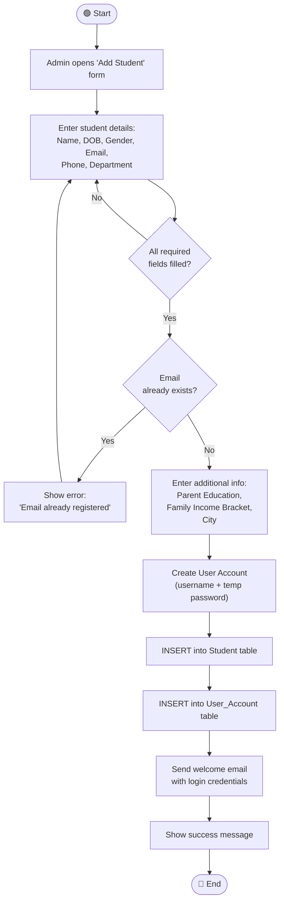
```mermaid
flowchart TD
    A([🟢 Start]) --> B["Admin opens 'Add Student' form"]
    B --> C["Enter student details:\nName, DOB, Gender, Email,\nPhone, Department"]
    C --> D{"All required\nfields filled?"}
    D -- No --> C
    D -- Yes --> E{"Email\nalready exists?"}
    E -- Yes --> F["Show error:\n'Email already registered'"]
    F --> C
    E -- No --> G["Enter additional info:\nParent Education,\nFamily Income Bracket,\nCity"]
    G --> H["Create User Account\n(username + temp password)"]
    H --> I["INSERT into Student table"]
    I --> J["INSERT into User_Account table"]
    J --> K["Send welcome email\nwith login credentials"]
    K --> L["Show success message"]
    L --> M([🔴 End])
```

### 4.2 Performance Analysis Workflow

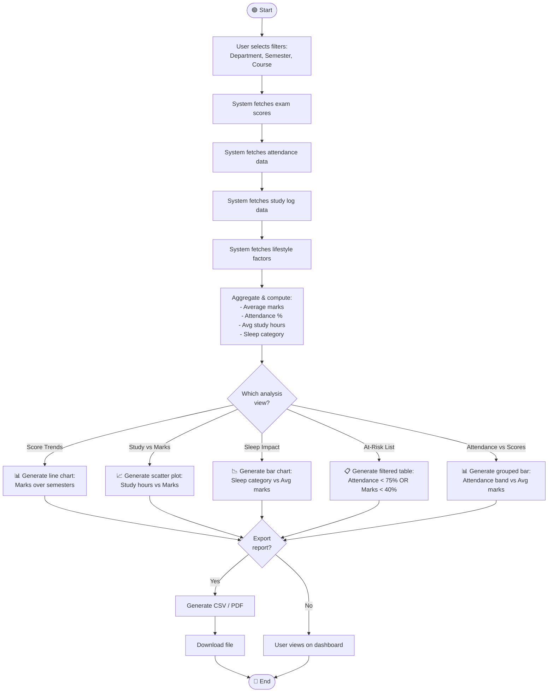
```mermaid
flowchart TD
    A([🟢 Start]) --> B["User selects filters:\nDepartment, Semester, Course"]
    B --> C["System fetches exam scores"]
    C --> D["System fetches attendance data"]
    D --> E["System fetches study log data"]
    E --> F["System fetches lifestyle factors"]
    F --> G["Aggregate & compute:\n- Average marks\n- Attendance %\n- Avg study hours\n- Sleep category"]
    G --> H{"Which analysis\nview?"}

    H -- "Score Trends" --> I["📊 Generate line chart:\nMarks over semesters"]
    H -- "Study vs Marks" --> J["📈 Generate scatter plot:\nStudy hours vs Marks"]
    H -- "Sleep Impact" --> K["📉 Generate bar chart:\nSleep category vs Avg marks"]
    H -- "At-Risk List" --> L["📋 Generate filtered table:\nAttendance < 75% OR Marks < 40%"]
    H -- "Attendance vs Scores" --> M2["📊 Generate grouped bar:\nAttendance band vs Avg marks"]

    I --> N{"Export\nreport?"}
    J --> N
    K --> N
    L --> N
    M2 --> N

    N -- Yes --> O["Generate CSV / PDF"]
    O --> P["Download file"]
    N -- No --> P2["User views on dashboard"]
    P --> Q([🔴 End])
    P2 --> Q
```

### 4.3 Attendance Marking Process

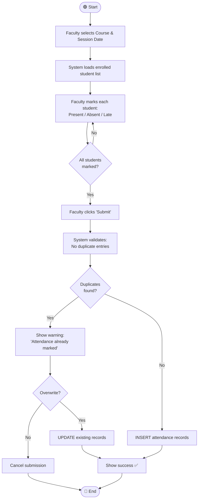
```mermaid
flowchart TD
    A([🟢 Start]) --> B["Faculty selects Course & Session Date"]
    B --> C["System loads enrolled student list"]
    C --> D["Faculty marks each student:\nPresent / Absent / Late"]
    D --> E{"All students\nmarked?"}
    E -- No --> D
    E -- Yes --> F["Faculty clicks 'Submit'"]
    F --> G["System validates:\nNo duplicate entries"]
    G --> H{"Duplicates\nfound?"}
    H -- Yes --> I["Show warning:\n'Attendance already marked'"]
    I --> J{"Overwrite?"}
    J -- Yes --> K["UPDATE existing records"]
    J -- No --> L["Cancel submission"]
    H -- No --> K2["INSERT attendance records"]
    K --> M["Show success ✅"]
    K2 --> M
    L --> N([🔴 End])
    M --> N
```

### 4.4 Study Log Entry Process

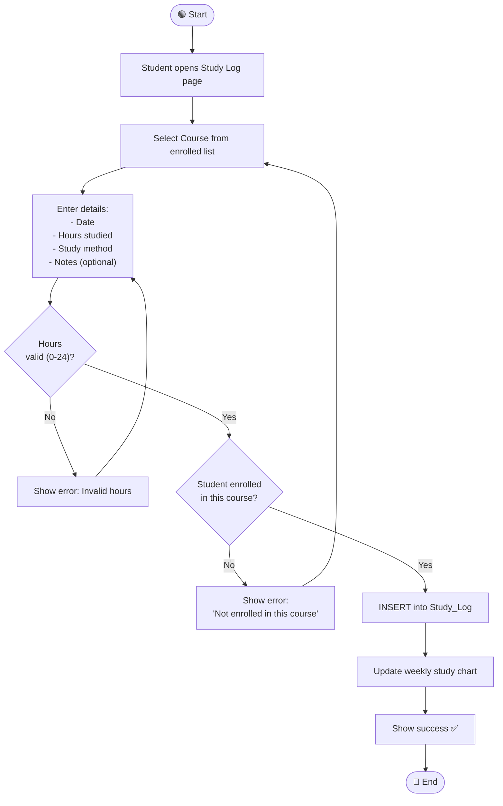
```mermaid
flowchart TD
    A([🟢 Start]) --> B["Student opens Study Log page"]
    B --> C["Select Course from enrolled list"]
    C --> D["Enter details:\n- Date\n- Hours studied\n- Study method\n- Notes (optional)"]
    D --> E{"Hours\nvalid (0-24)?"}
    E -- No --> F["Show error: Invalid hours"]
    F --> D
    E -- Yes --> G{"Student enrolled\nin this course?"}
    G -- No --> H["Show error:\n'Not enrolled in this course'"]
    H --> C
    G -- Yes --> I["INSERT into Study_Log"]
    I --> J["Update weekly study chart"]
    J --> K["Show success ✅"]
    K --> L([🔴 End])
```

---

## 5. State Diagram

> Shows the **lifecycle states** of a key entity.

### 5.1 Student Enrollment Lifecycle

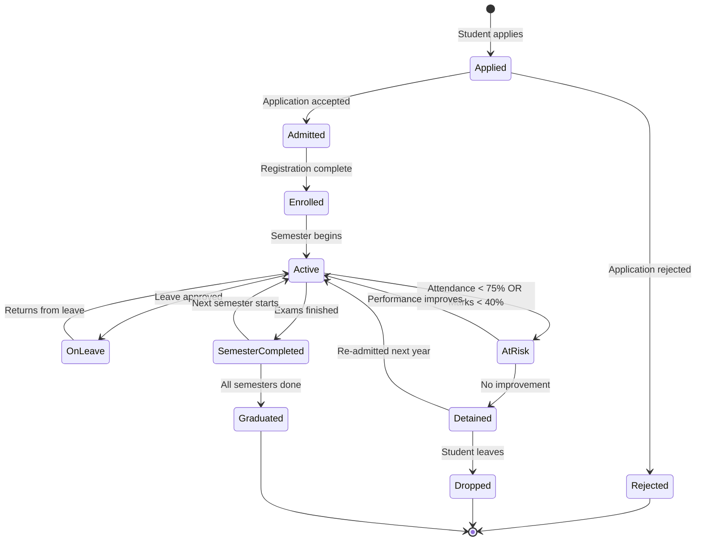
```mermaid
stateDiagram-v2
    [*] --> Applied : Student applies

    Applied --> Admitted : Application accepted
    Applied --> Rejected : Application rejected

    Rejected --> [*]

    Admitted --> Enrolled : Registration complete
    Enrolled --> Active : Semester begins

    Active --> OnLeave : Leave approved
    OnLeave --> Active : Returns from leave

    Active --> AtRisk : Attendance < 75% OR Marks < 40%
    AtRisk --> Active : Performance improves
    AtRisk --> Detained : No improvement

    Active --> SemesterCompleted : Exams finished
    SemesterCompleted --> Active : Next semester starts
    SemesterCompleted --> Graduated : All semesters done

    Detained --> Active : Re-admitted next year
    Detained --> Dropped : Student leaves

    Dropped --> [*]
    Graduated --> [*]
```

### 5.2 Exam Score Lifecycle

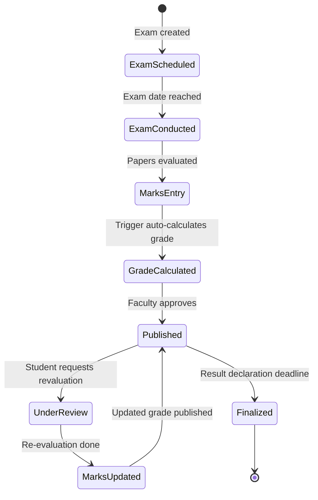
```mermaid
stateDiagram-v2
    [*] --> ExamScheduled : Exam created

    ExamScheduled --> ExamConducted : Exam date reached
    ExamConducted --> MarksEntry : Papers evaluated

    MarksEntry --> GradeCalculated : Trigger auto-calculates grade
    GradeCalculated --> Published : Faculty approves

    Published --> UnderReview : Student requests revaluation
    UnderReview --> MarksUpdated : Re-evaluation done
    MarksUpdated --> Published : Updated grade published

    Published --> Finalized : Result declaration deadline
    Finalized --> [*]
```

---

## 6. Data Flow Diagrams (DFD)

### 6.1 Level 0 — Context Diagram

> Shows the **entire system as one process** with external entities.

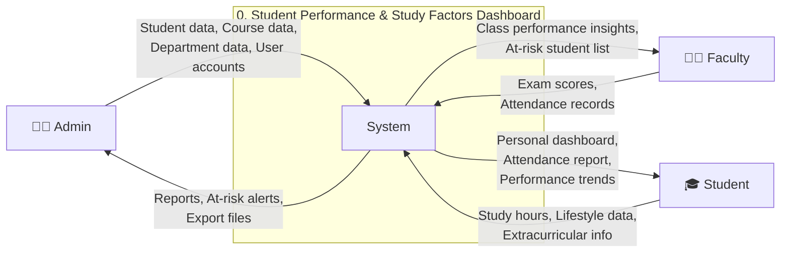
```mermaid
flowchart LR
    Admin["🧑‍💼 Admin"]
    Faculty["👩‍🏫 Faculty"]
    StudentActor["🎓 Student"]

    subgraph P0["0. Student Performance & Study Factors Dashboard"]
        Core["System"]
    end

    Admin -->|"Student data, Course data,\nDepartment data, User accounts"| Core
    Core -->|"Reports, At-risk alerts,\nExport files"| Admin

    Faculty -->|"Exam scores,\nAttendance records"| Core
    Core -->|"Class performance insights,\nAt-risk student list"| Faculty

    StudentActor -->|"Study hours, Lifestyle data,\nExtracurricular info"| Core
    Core -->|"Personal dashboard,\nAttendance report,\nPerformance trends"| StudentActor
```

### 6.2 Level 1 — Major Processes

> Breaks the system into **major sub-processes** and data stores.

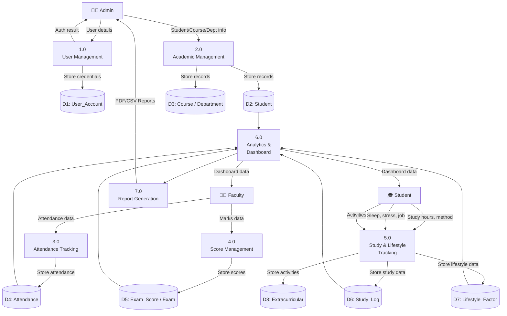
```mermaid
flowchart TD
    Admin["🧑‍💼 Admin"]
    Faculty["👩‍🏫 Faculty"]
    StudentActor["🎓 Student"]

    P1["1.0\nUser Management"]
    P2["2.0\nAcademic Management"]
    P3["3.0\nAttendance Tracking"]
    P4["4.0\nScore Management"]
    P5["5.0\nStudy & Lifestyle\nTracking"]
    P6["6.0\nAnalytics &\nDashboard"]
    P7["7.0\nReport Generation"]

    DS1[("D1: User_Account")]
    DS2[("D2: Student")]
    DS3[("D3: Course / Department")]
    DS4[("D4: Attendance")]
    DS5[("D5: Exam_Score / Exam")]
    DS6[("D6: Study_Log")]
    DS7[("D7: Lifestyle_Factor")]
    DS8[("D8: Extracurricular")]

    Admin -->|"User details"| P1
    P1 -->|"Store credentials"| DS1
    P1 -->|"Auth result"| Admin

    Admin -->|"Student/Course/Dept info"| P2
    P2 -->|"Store records"| DS2
    P2 -->|"Store records"| DS3

    Faculty -->|"Attendance data"| P3
    P3 -->|"Store attendance"| DS4

    Faculty -->|"Marks data"| P4
    P4 -->|"Store scores"| DS5

    StudentActor -->|"Study hours, method"| P5
    StudentActor -->|"Sleep, stress, job"| P5
    StudentActor -->|"Activities"| P5
    P5 -->|"Store study data"| DS6
    P5 -->|"Store lifestyle data"| DS7
    P5 -->|"Store activities"| DS8

    DS2 --> P6
    DS4 --> P6
    DS5 --> P6
    DS6 --> P6
    DS7 --> P6

    P6 -->|"Dashboard data"| Faculty
    P6 -->|"Dashboard data"| StudentActor

    P6 --> P7
    P7 -->|"PDF/CSV Reports"| Admin
```

### 6.3 Level 2 — Score Management (Process 4.0 Expanded)

> Zooms into **one process** to show detailed sub-steps.

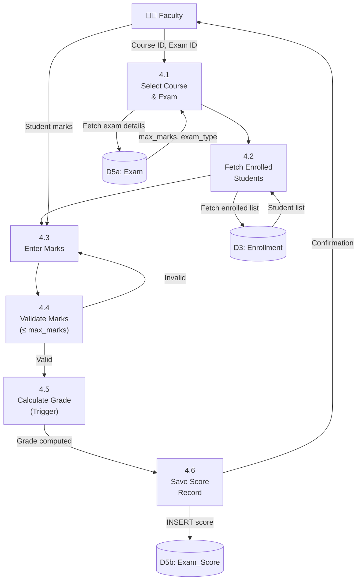
```mermaid
flowchart TD
    Faculty["👩‍🏫 Faculty"]

    P41["4.1\nSelect Course\n& Exam"]
    P42["4.2\nFetch Enrolled\nStudents"]
    P43["4.3\nEnter Marks"]
    P44["4.4\nValidate Marks\n(≤ max_marks)"]
    P45["4.5\nCalculate Grade\n(Trigger)"]
    P46["4.6\nSave Score\nRecord"]

    DS_Enrollment[("D3: Enrollment")]
    DS_Exam[("D5a: Exam")]
    DS_Score[("D5b: Exam_Score")]

    Faculty -->|"Course ID, Exam ID"| P41
    P41 -->|"Fetch exam details"| DS_Exam
    DS_Exam -->|"max_marks, exam_type"| P41
    P41 --> P42
    P42 -->|"Fetch enrolled list"| DS_Enrollment
    DS_Enrollment -->|"Student list"| P42
    P42 --> P43
    Faculty -->|"Student marks"| P43
    P43 --> P44
    P44 -->|"Invalid"| P43
    P44 -->|"Valid"| P45
    P45 -->|"Grade computed"| P46
    P46 -->|"INSERT score"| DS_Score
    P46 -->|"Confirmation"| Faculty
```

---

## 7. ER Diagram (Entity-Relationship)

> Shows **database entities**, their **attributes**, and **relationships**.

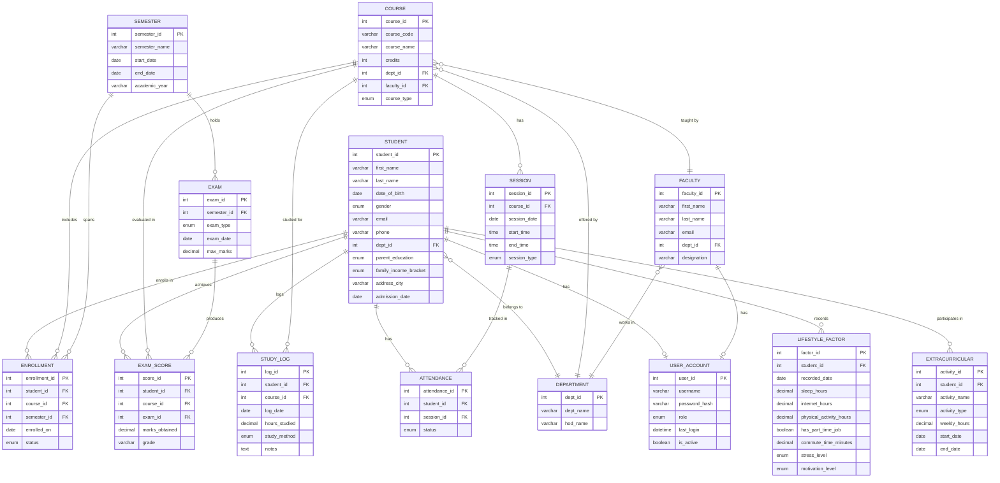
```mermaid
erDiagram
    STUDENT ||--o{ ENROLLMENT : "enrolls in"
    STUDENT ||--o{ ATTENDANCE : "has"
    STUDENT ||--o{ EXAM_SCORE : "achieves"
    STUDENT ||--o{ STUDY_LOG : "logs"
    STUDENT ||--o{ LIFESTYLE_FACTOR : "records"
    STUDENT ||--o{ EXTRACURRICULAR : "participates in"
    STUDENT }o--|| DEPARTMENT : "belongs to"
    STUDENT ||--o| USER_ACCOUNT : "has"

    COURSE ||--o{ ENROLLMENT : "includes"
    COURSE ||--o{ EXAM_SCORE : "evaluated in"
    COURSE ||--o{ STUDY_LOG : "studied for"
    COURSE ||--o{ SESSION : "has"
    COURSE }o--|| DEPARTMENT : "offered by"
    COURSE }o--|| FACULTY : "taught by"

    FACULTY }o--|| DEPARTMENT : "works in"
    FACULTY ||--o| USER_ACCOUNT : "has"

    SESSION ||--o{ ATTENDANCE : "tracked in"
    SEMESTER ||--o{ ENROLLMENT : "spans"
    SEMESTER ||--o{ EXAM : "holds"
    EXAM ||--o{ EXAM_SCORE : "produces"

    STUDENT {
        int student_id PK
        varchar first_name
        varchar last_name
        date date_of_birth
        enum gender
        varchar email
        varchar phone
        int dept_id FK
        enum parent_education
        enum family_income_bracket
        varchar address_city
        date admission_date
    }

    DEPARTMENT {
        int dept_id PK
        varchar dept_name
        varchar hod_name
    }

    FACULTY {
        int faculty_id PK
        varchar first_name
        varchar last_name
        varchar email
        int dept_id FK
        varchar designation
    }

    COURSE {
        int course_id PK
        varchar course_code
        varchar course_name
        int credits
        int dept_id FK
        int faculty_id FK
        enum course_type
    }

    SEMESTER {
        int semester_id PK
        varchar semester_name
        date start_date
        date end_date
        varchar academic_year
    }

    ENROLLMENT {
        int enrollment_id PK
        int student_id FK
        int course_id FK
        int semester_id FK
        date enrolled_on
        enum status
    }

    SESSION {
        int session_id PK
        int course_id FK
        date session_date
        time start_time
        time end_time
        enum session_type
    }

    ATTENDANCE {
        int attendance_id PK
        int student_id FK
        int session_id FK
        enum status
    }

    EXAM {
        int exam_id PK
        int semester_id FK
        enum exam_type
        date exam_date
        decimal max_marks
    }

    EXAM_SCORE {
        int score_id PK
        int student_id FK
        int course_id FK
        int exam_id FK
        decimal marks_obtained
        varchar grade
    }

    STUDY_LOG {
        int log_id PK
        int student_id FK
        int course_id FK
        date log_date
        decimal hours_studied
        enum study_method
        text notes
    }

    LIFESTYLE_FACTOR {
        int factor_id PK
        int student_id FK
        date recorded_date
        decimal sleep_hours
        decimal internet_hours
        decimal physical_activity_hours
        boolean has_part_time_job
        decimal commute_time_minutes
        enum stress_level
        enum motivation_level
    }

    EXTRACURRICULAR {
        int activity_id PK
        int student_id FK
        varchar activity_name
        enum activity_type
        decimal weekly_hours
        date start_date
        date end_date
    }

    USER_ACCOUNT {
        int user_id PK
        varchar username
        varchar password_hash
        enum role
        datetime last_login
        boolean is_active
    }
```

---

## 8. Component Diagram

> Shows the **software components/modules** and their dependencies.

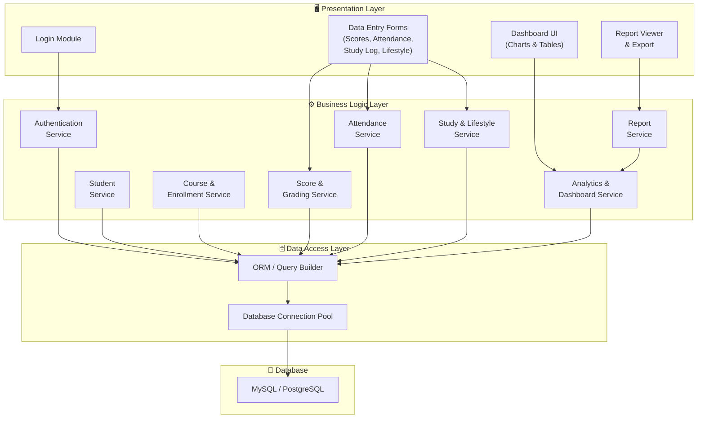
```mermaid
flowchart TD
    subgraph Presentation["🖥️ Presentation Layer"]
        C1["Login Module"]
        C2["Dashboard UI\n(Charts & Tables)"]
        C3["Data Entry Forms\n(Scores, Attendance,\nStudy Log, Lifestyle)"]
        C4["Report Viewer\n& Export"]
    end

    subgraph Business["⚙️ Business Logic Layer"]
        C5["Authentication\nService"]
        C6["Student\nService"]
        C7["Course &\nEnrollment Service"]
        C8["Score &\nGrading Service"]
        C9["Attendance\nService"]
        C10["Study & Lifestyle\nService"]
        C11["Analytics &\nDashboard Service"]
        C12["Report\nService"]
    end

    subgraph Data["🗄️ Data Access Layer"]
        C13["ORM / Query Builder"]
        C14["Database Connection Pool"]
    end

    subgraph DB["💾 Database"]
        C15["MySQL / PostgreSQL"]
    end

    C1 --> C5
    C2 --> C11
    C3 --> C8
    C3 --> C9
    C3 --> C10
    C4 --> C12

    C5 --> C13
    C6 --> C13
    C7 --> C13
    C8 --> C13
    C9 --> C13
    C10 --> C13
    C11 --> C13
    C12 --> C11

    C13 --> C14
    C14 --> C15
```

---

## 9. Deployment Diagram

> Shows **where** the software runs — hardware, servers, and network.

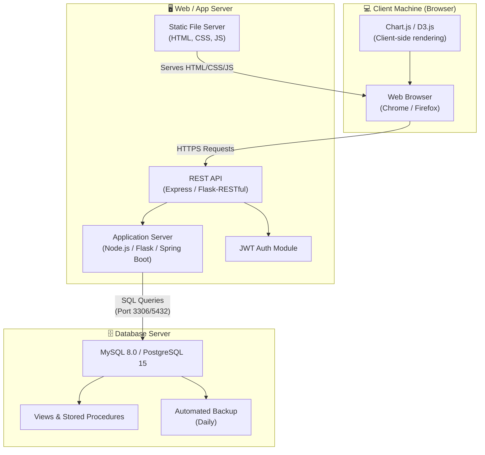
```mermaid
flowchart TD
    subgraph Client["💻 Client Machine (Browser)"]
        Browser["Web Browser\n(Chrome / Firefox)"]
        Charts["Chart.js / D3.js\n(Client-side rendering)"]
    end

    subgraph WebServer["🖥️ Web / App Server"]
        App["Application Server\n(Node.js / Flask / Spring Boot)"]
        API["REST API\n(Express / Flask-RESTful)"]
        Auth["JWT Auth Module"]
        Static["Static File Server\n(HTML, CSS, JS)"]
    end

    subgraph DBServer["🗄️ Database Server"]
        DBMS["MySQL 8.0 / PostgreSQL 15"]
        Views["Views & Stored Procedures"]
        Backup["Automated Backup\n(Daily)"]
    end

    Browser -->|"HTTPS Requests"| API
    Static -->|"Serves HTML/CSS/JS"| Browser
    Charts --> Browser

    API --> Auth
    API --> App
    App -->|"SQL Queries\n(Port 3306/5432)"| DBMS
    DBMS --> Views
    DBMS --> Backup
```

---

## 📋 Summary: All Software Models

| # | Model | Type | Purpose |
|---|-------|------|---------|
| 1 | Use Case Diagram | UML Behavioral | Who does what |
| 2 | Class Diagram | UML Structural | System structure with attributes & methods |
| 3 | Sequence Diagrams (×5) | UML Behavioral | Step-by-step message flow for key operations |
| 4 | Activity Diagrams (×4) | UML Behavioral | Workflow / process steps |
| 5 | State Diagrams (×2) | UML Behavioral | Entity lifecycle states |
| 6 | DFD Level 0, 1, 2 | Structured | Data flow between processes & stores |
| 7 | ER Diagram | Database | Entities, attributes, relationships |
| 8 | Component Diagram | UML Structural | Module dependencies |
| 9 | Deployment Diagram | UML Physical | Hardware & network layout |

---

> [!TIP]
> To use these diagrams in your project report, you can either **screenshot them from this preview** or paste the Mermaid code into [mermaid.live](https://mermaid.live) to export as **PNG/SVG** images.
